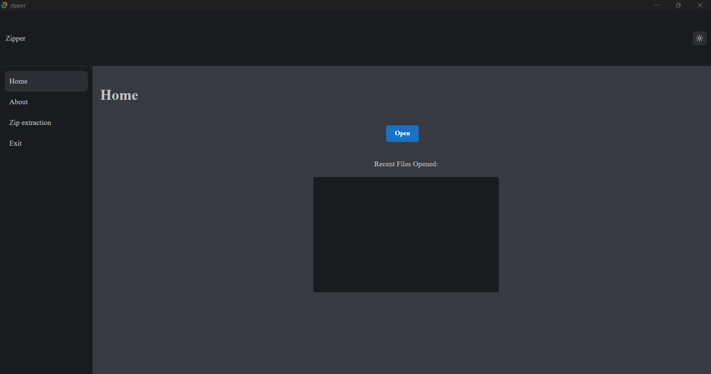
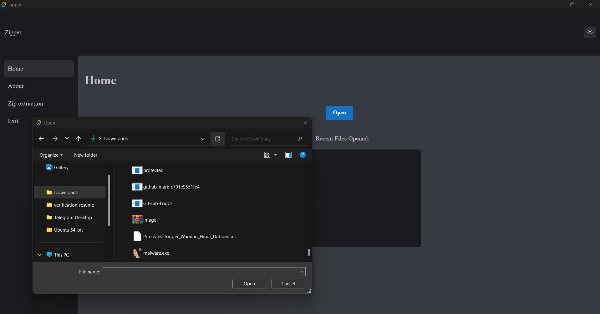
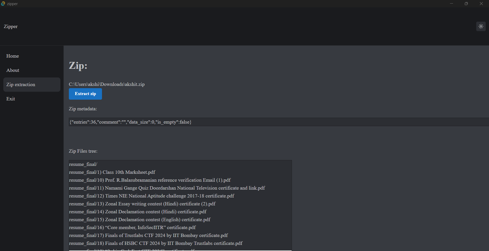
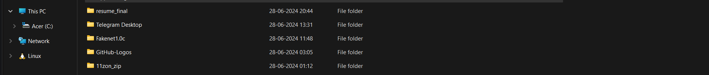
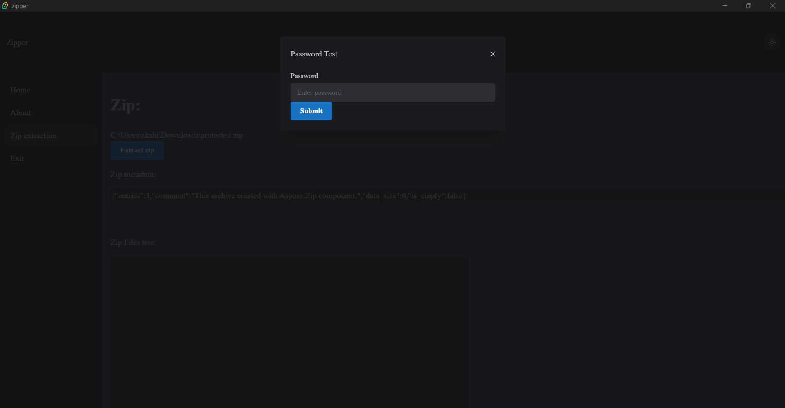
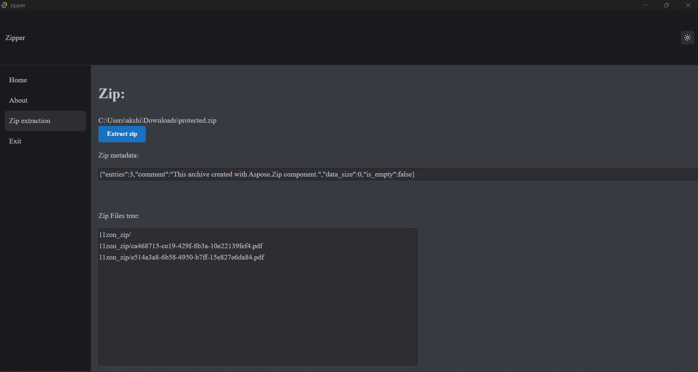
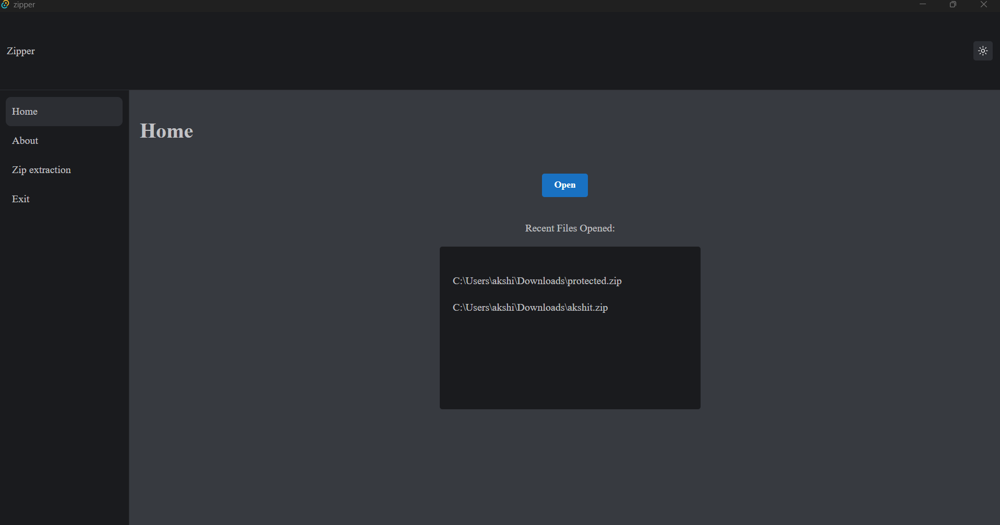

# Zipper

## A Rust based zip analysis and extraction tool


A zip extraction tool that not only provides all the features of a typical zip extraction tool like 7zip but also provides user-friendly features like reading the metadata of the central directory of the zip archive and decrypting the zip with password prompts.It also saves time by showing the user all the zip files recently opened.

The tool is entirely based on the Tauri framework of Rust that is used for integration of frontend of ReactJS to the Rust backend in an efficient and easy manner. 

### Installation

You can install zipper directly from its source code `git clone https://github.com/it4ch1-007/zipper.git` and run the following commands in your system:


- If you donot have Node.js:

 Download it from: 
 
  https://nodejs.org/en/download/package-manager

- Now install yarn using: 

`npm install --global yarn`

or 

Download it from:

https://classic.yarnpkg.com/lang/en/docs/install/#windows-stable

- If you donot have Rust installed:

Download it from: `https://www.rust-lang.org/tools/install`.

- Now install tauri framework using:

``

- Now to build the project execute the commands:

```
cd zipper/src-tauri/src

yarn add @tauri-apps/api@* @emotion/cache@^11.11.0 @emotion/react@^11.11.4 @mantine/core@7.10.2 @mantine/hooks@* @mantine/styles@^6.0.21 @testing-library/jest-dom@^5.17.0 @testing-library/react@^13.4.0 @testing-library/user-event@^13.5.0 react@^18.3.1 react-dom@^18.3.1 react-router-dom@6 react-scripts@^3.0.1 web-vitals@^2.1.4 yarn@^1.22.22

OR 

yarn install

yarn tauri dev
```

### Using Zipper

- At the home page Zipper gives us the names of all those zip files that we have extracted recently using it. 

- Click the `Open` button to open the dialog box and choose the zipfile of your choice to see its metadata and files inside it.

- If in any case the zip is encrypted then a prompt will ask for the password to enter for the zip. If it is correct then the zip will be unlocked however if the password is wrong then Zipper will exit immediately.

- Click on the `Extract` button to extract the zip file in the same directory as the zip file.

### Demo video

[![Video]]([http://www.youtube.com/watch?v=YOUR_VIDEO_ID_HERE](https://www.youtube.com/watch?v=1qEU_QrY6qs&ab_channel=AKSHITSINGH))

### Demo Screenshots


- Home page



- Opening the file dialog box



- Showing the zip metadata and the zip files tree



- Alert when the zip is extracted 


- Showing the extracted files in the same directory.



- Password prompt for the encrypted zip files



- Extracting the encrypted zip files after entering the right password. If wrong password is entered then the application will exit immediately.



- Showing the updated home page when we extracted the 2 zip files shown:




### Future goals of the project

In the future I am going to integrate the working of `bkcrack` tool that is able to crack a zip file without any password or wordlist and also the bruteforcing option where the user can choose any wordlist of his own and crack the zip file without its password. 
